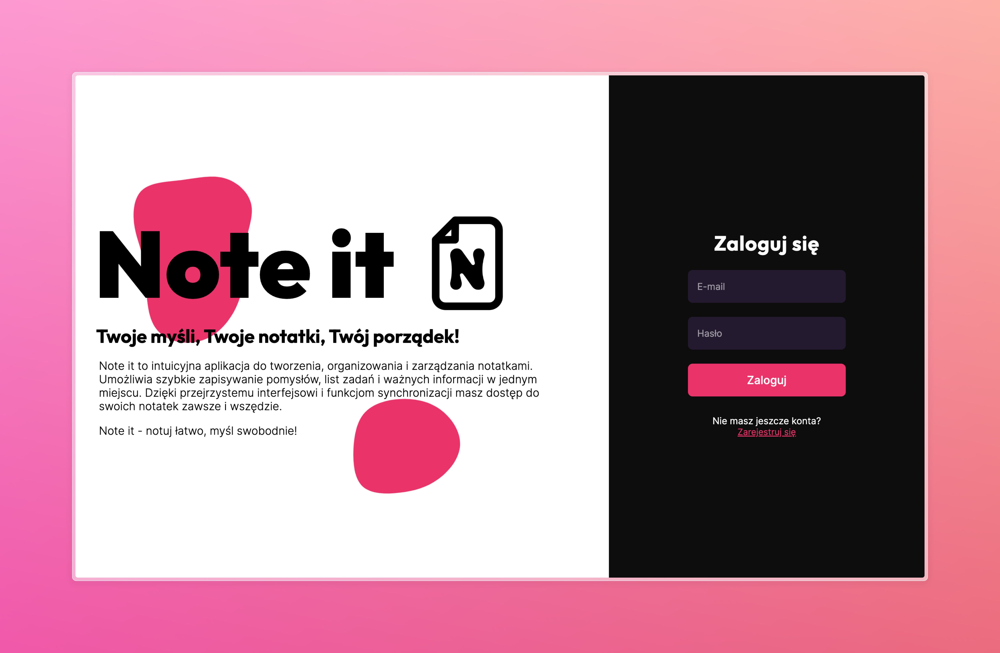
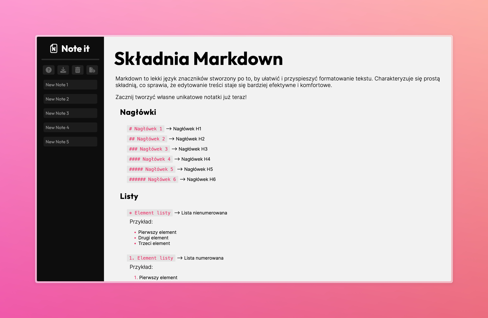

# NoteIt

## Opis projektu
NoteIt to aplikacja stworzona w React, umożliwiająca tworzenie i edytowanie własnych notatek za pomocą znaczników markdown. Aplikacja została stworzona na potrzeby zaliczenia przedmiotu Języki Skryptowe i Znaczników.




## Technologie
- React
- JavaScript (ES6+)
- HTML5
- CSS3

## Funkcjonalności
- Tworzenie notatek za pomocą znachników markdown
- Edycja notatek
- Usuwanie notatek
- Pobieranie notatek

## Instalacja
1. Sklonuj repozytorium:
  ```bash
  git clone https://github.com/KAPIQ03/NoteIt.git
  ```
2. Przejdź do katalogu projektu:
  ```bash
  cd NoteIt
  ```
3. Zainstaluj zależności:
  ```bash
  npm install
  ```

## Uruchomienie
Aby uruchomić aplikację w trybie deweloperskim, użyj:
```bash
npm start
```
Aplikacja będzie dostępna pod adresem: [http://localhost:3000](http://localhost:3000).

## Autorzy
- Kacper Szamszon
