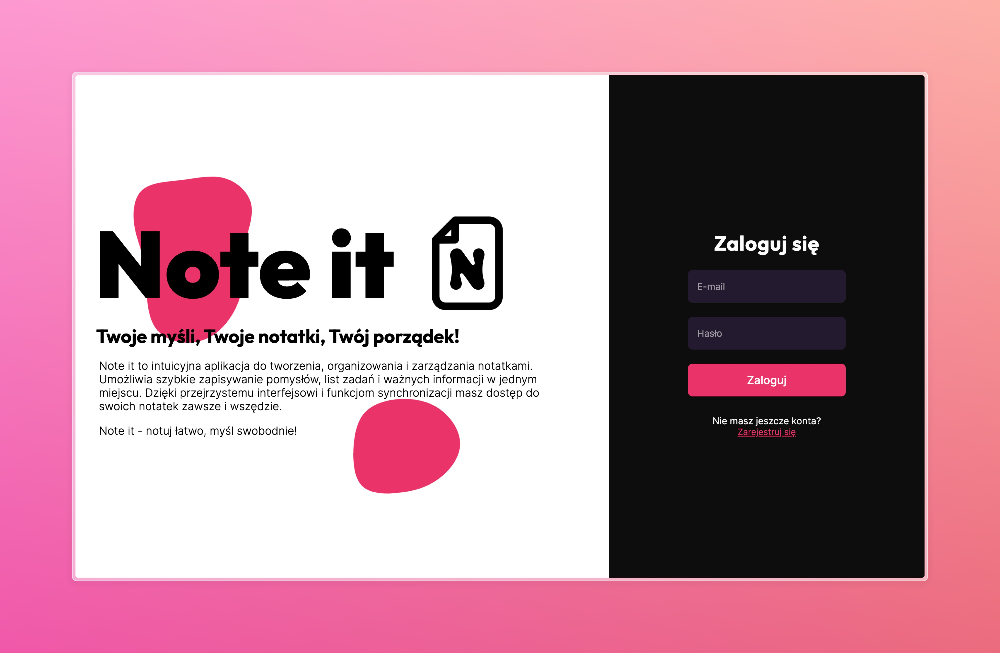
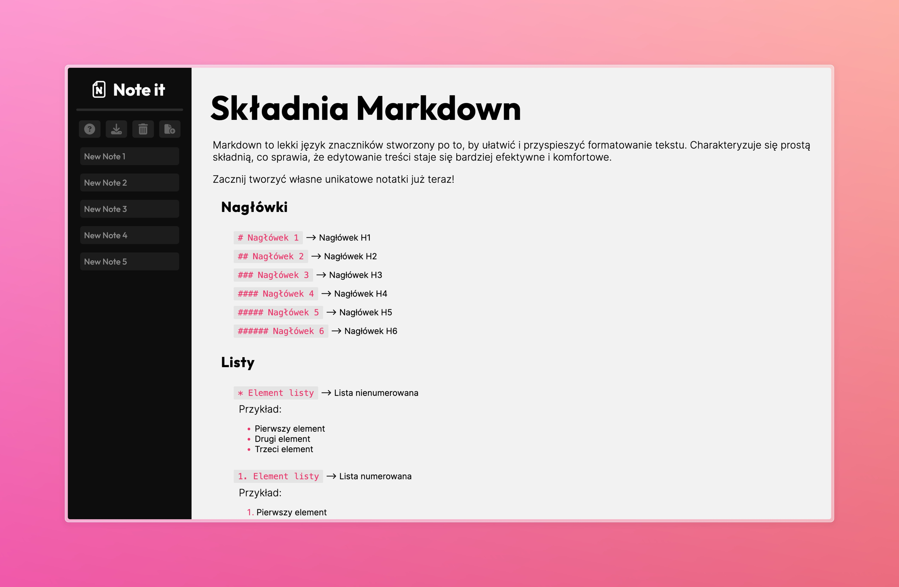

#  NoteIt

A sleek, modern Markdown-based note-taking application built with **React**. NoteIt empowers users to create, edit, and organize thoughts with a clean interface and powerful markdown support.

> **Note:** This project was developed for the *Scripting and Markup Languages* (Języki Skryptowe i Znaczników) course. It currently operates as a front-end prototype without a persistent database.

---

## ✨ Features

- 📝 **Markdown Integration** – Write notes using full Markdown syntax support.
- 🖼️ **Live Preview** – See your changes in real-time.
- 📄 **Export to PDF** – Download or print your notes directly from the app.
- 🎨 **Minimalist Design** – Focused workspace for distraction-free writing.
- 🔄 **Dynamic Management** – Easily add, edit, and delete notes.
- 🔐 **Authentication Flow** – Prototype login and registration system.

---

## 🚀 Getting Started

### Prerequisites

- [Node.js](https://nodejs.org/) (v16 or higher recommended)
- [npm](https://www.npmjs.com/) (installed automatically with Node.js)

### Installation

1. **Clone the repository:**
   ```bash
   git clone https://github.com/KAPIQ03/NoteIt.git
   cd NoteIt
   ```

2. **Install dependencies:**
   ```bash
   npm install
   ```

### Running Locally

To start the development server:
```bash
npm start
```
The application will be available at [http://localhost:3000](http://localhost:3000).

---

## 🛠️ Tech Stack

- **Framework:** [React 19](https://react.dev/)
- **Routing:** [React Router](https://reactrouter.com/)
- **Markdown:** [React-Markdown](https://github.com/remarkjs/react-markdown) & [Remark](https://remark.js.org/)
- **Forms:** [React Hook Form](https://react-hook-form.com/)
- **Icons:** [React Icons](https://react-icons.github.io/react-icons/)
- **Styling:** CSS Modules (Modern CSS3)

---

## 💡 How to Use

As this version lacks a database, you can access the dashboard using the following credentials:

- **Email:** `a@b.c` (or any valid email format)
- **Password:** `a`

### Login Screen


### Workspace Controls
Inside the application, the right-side panel allows you to:
- 🏠 **Home:** View the list of supported markdown tags.
- 🖨️ **Print:** Export your note as a PDF.
- 🗑️ **Delete:** Remove the current note.
- ➕ **Add:** Create a new workspace for your thoughts.

*To rename a note, simply click on its title in the editor view.*

### Application View


---

## 👤 Author

- **Kacper Szamszon**

---

*This project is for educational purposes as part of the Scripting and Markup Languages course.*
